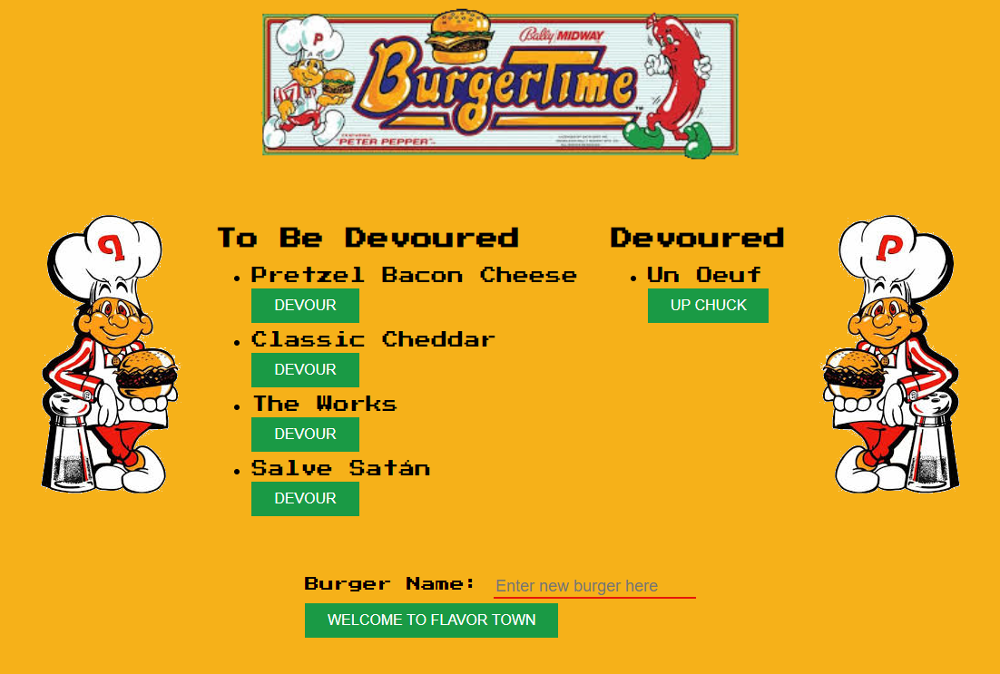

# Burger Time! 

Burger Time is an homage to the old arcade game [Burger Time](https://en.wikipedia.org/wiki/BurgerTime). The application allows the user to add new burgers to the list or to devour the already created burgers. I added an "Up Chuck" button for fun to allow the user to move the burger from devoured back to the To Be Devoured list. The application is running on a server, deployed on heroku, and uses a [JAWS DB](https://devcenter.heroku.com/articles/jawsdb) to allow the users to add things and take things away.

I pulled all the images from google and used [gimp](https://www.gimp.org/) to remove the existing backgrounds and get just the portion of the images that I wanted.

This application is deployed on Heroku for you to play with [here](https://dashboard.heroku.com/apps/fierce-lowlands-86623)

This application was authored by [Zach LaFleur](https://github.com/MrCartree)